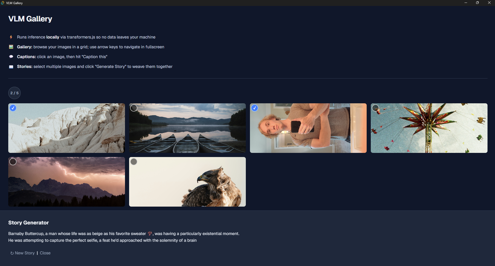
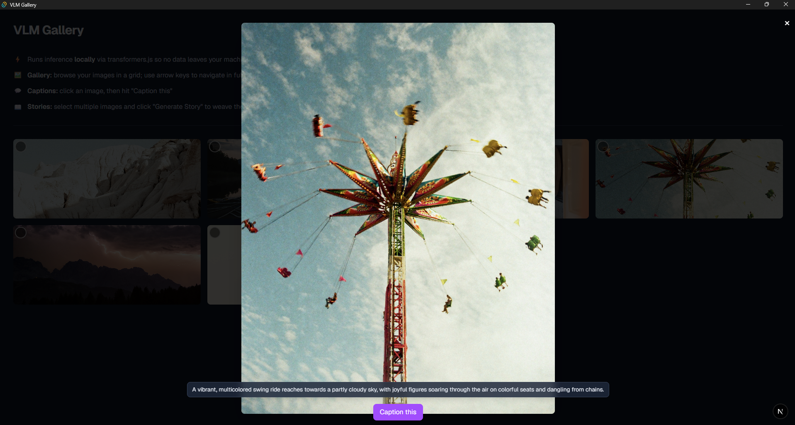

# T3 (VLM) Gallery



<br />

VLM Gallery is an on device VLM application that allows you to caption and generate funny stories from your photos!
The app runs completely locally after initial download via [transformers.js](https://huggingface.co/docs/transformers.js/index) so none of your pictures ever leave your device. The application loads pictures from your [picture directory](https://v2.tauri.app/reference/javascript/api/namespacepath/#picturedir), so make sure your pictures are there before downloading one of the latest builds.

## Features
- 100% local features and model ([Gemma3n 4 bit quantization ONNX](https://huggingface.co/onnx-community/gemma-3n-E2B-it-ONNX))
- Browse your images up close by clicking on them! You can also use the arrow keys to navigate between them.
- Caption your images by clicking the "Caption this" button while in fullscreen!
- Select 2-5 photos and click "Generate Story" to generate a funny story from the selected images

## Getting Started

**Download a build:** grab the latest installer for your platform from the
[Releases page](https://github.com/dzur658/T3-Gallery-Tauri/releases).

**Run from source:** requires Node.js 20+, pnpm, and Rust. See [Tauri Quickstart](https://v2.tauri.app/start/prerequisites/) for more details.

```bash
pnpm install
pnpm tauri dev     # development with hot reload
pnpm tauri build   # production build
```

## First Run
- The app downloads the Gemma 3n model quantized to 4 bit on first launch (then loads from cache subsequently).
- Progress displayed for download and model loading.
- Uses WebGPU if available, otherwise falls back to CPU.

<br />
<br />




## Technical Specs
- Built with [Tauri](https://tauri.app/)
- [T3 stack](https://create.t3.gg/en/introduction) for frontend
- [Tailwind CSS](https://tailwindcss.com/) for styling
- [transformers.js](https://huggingface.co/docs/transformers.js/index) for inference and model loading